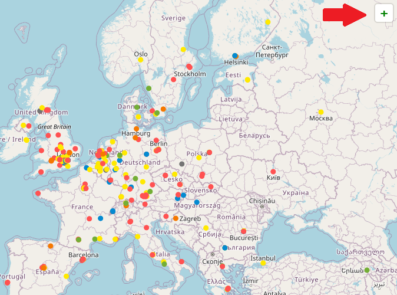

# Geospatial Companies

A map showing Geospatial companies, data origanilly collected by [chrieke](https://github.com/chrieke) and a list by countries is available at [https://github.com/chrieke/awesome-geospatial-companies](https://github.com/chrieke/awesome-geospatial-companies).  

## 
[The Live Map](https://bogind.github.io/Geospatial-Companies/)

## So why make a copy?

* The previous list is hosted on Google MyMaps which doesn't allow additions or comments.

* The previous list only had addresses, no coordinates so it could **only** be displayed on Google MyMaps

* This map uses geocoded data hosted on [Google Sheets](https://docs.google.com/spreadsheets/d/1pQQfcpPsh2EIJxCamAsL8B4c_GI8BaT-r8LCNckuE5w/edit?usp=sharing), where you can offer corrections.

* You can save the layer this map uses directly into QGIS or any other web map, with [this link](https://script.google.com/macros/s/AKfycbwMj3p--L1h57PB_b1TUF1h-fYgMZGRYaHaSBmQ6_3ZyzL2jT8lqCwhB-b-obgRFwgZbg/exec)

* This map also has form you can open with the <b style="color:green">+</b> at the top right of the map. You can suggest new companies to be added.

## Enjoy, Share the data and help keep it current for all interested.